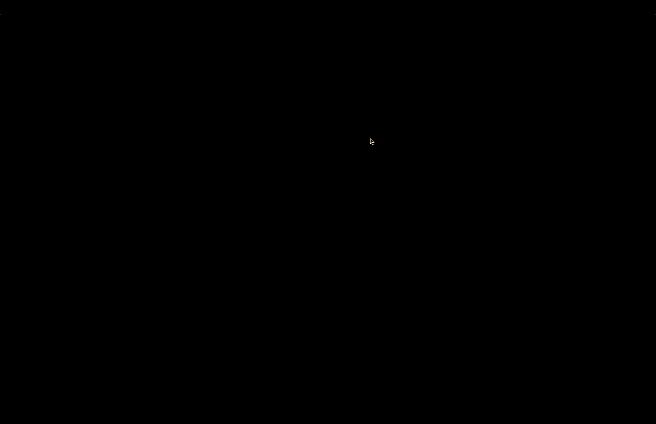

## Space Landscape
This project showcases a procedural space landscape using Shadertoy. The animation features a 3D rendered landscape with rolling hills, dynamic lighting, and realistic shadows, all generated using signed distance functions (SDFs) and ray marching techniques.

Features  
- Procedural Terrain: A dynamically generated landscape with rolling hills.  
- Dynamic Lighting: Real-time lighting effects with soft shadows.  
- Interactive Camera: The camera and light positions can be controlled with the mouse.  

You can view a live demo of the project on Shadertoy [here](https://www.shadertoy.com/view/DtKfRm).

.
