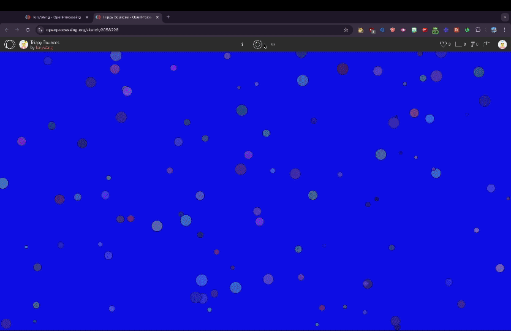

# Trippy Bounces

This project showcases an interactive particle system using the p5.js library. The animation features various particles bouncing around the screen with dynamically changing background colors, creating a trippy visual effect. Particles change direction upon collision with each other or the edges of the canvas.  

Features  
- Dynamic Background: The background color transitions smoothly between blue and yellow.  
- Interactive Particles: Particles bounce around the canvas and change direction upon collision.  
- Random Colors and Sizes: Each particle is assigned a random color and size.  

You can view a live demo of the project [here](https://openprocessing.org/sketch/2058228).

.
